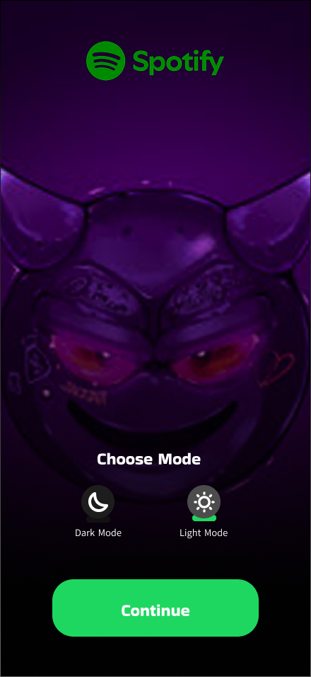
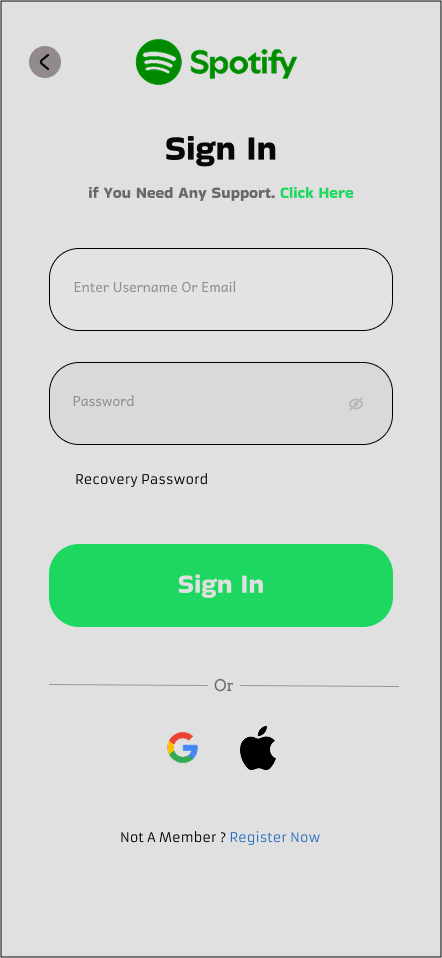
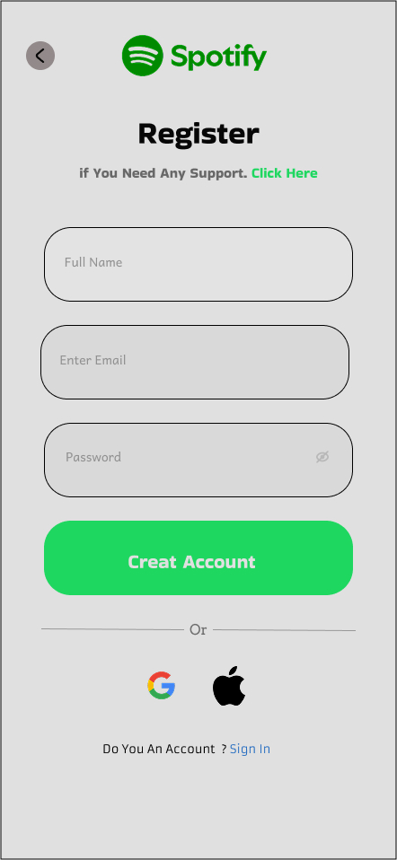
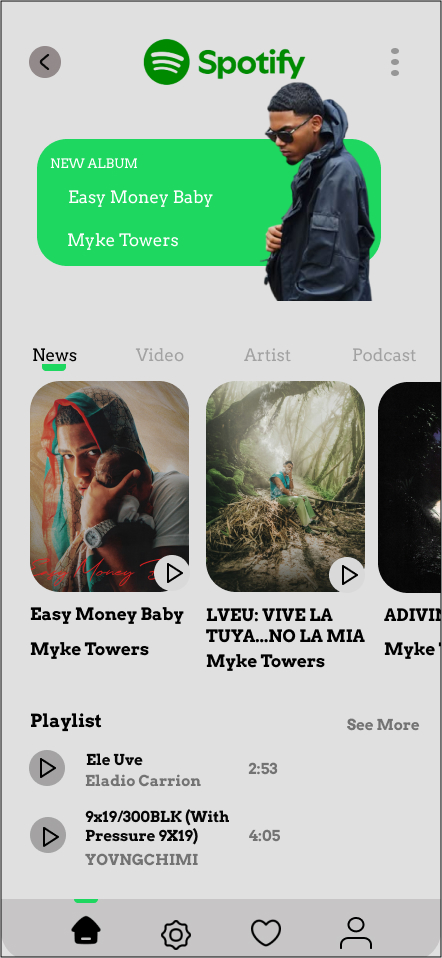
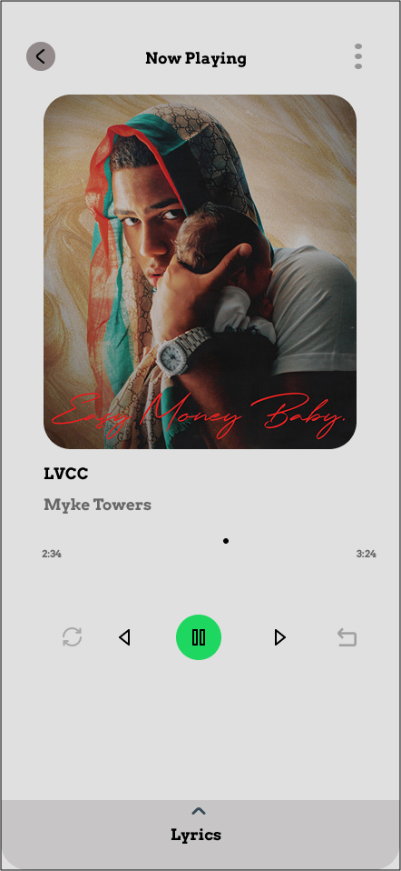
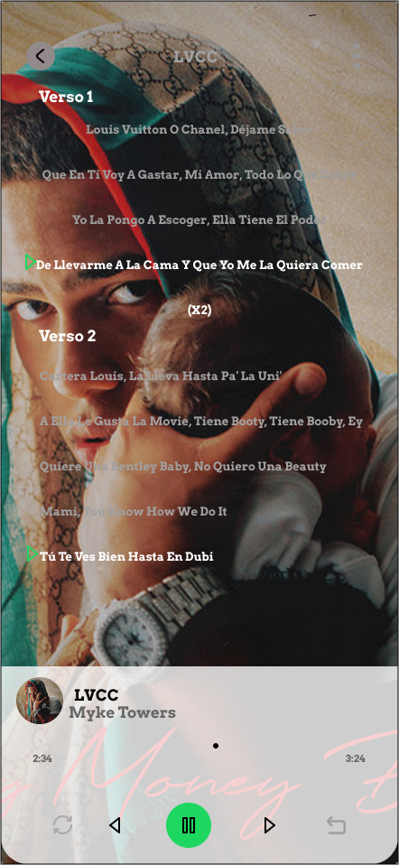
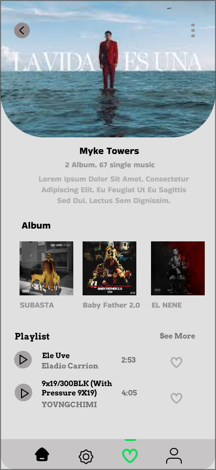
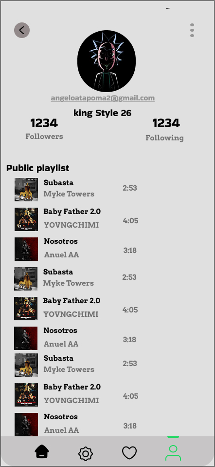

# Figma_Spotify
## Aqui podras ver El inicio de Spotify
 
## Aqui le das continuar

## Aqui das clic en registrar

## Aqui creas tu usuario y tu contraseña
 
## Aqui nuevamente creas tu gmail con tu usuario y contraseña
 
## ## Aqui Ingresaste con tu usuario
 
## Aqui podras visualizar el corrido del mausica de Myke Towers
 
## Aqui podras visualizar una cancion de Myke Towers con letra

## Aqui puedes elegir otro tipo de genero 
 
## Aqui elegimos el genero de Myke Towers

## Aqui vemos lo que es el usario y las musicas elegidas o dadas Me Gusta 
